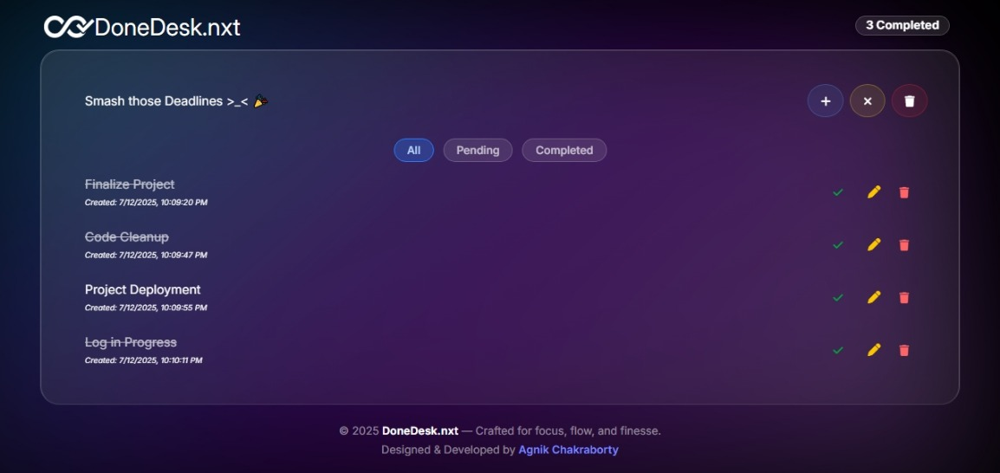
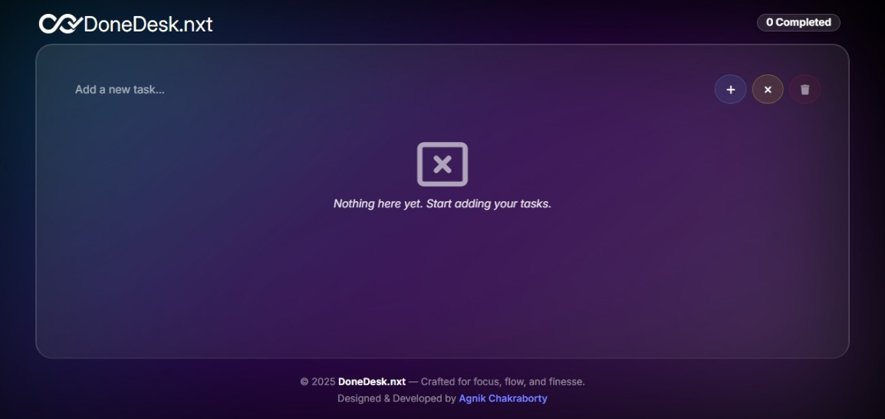
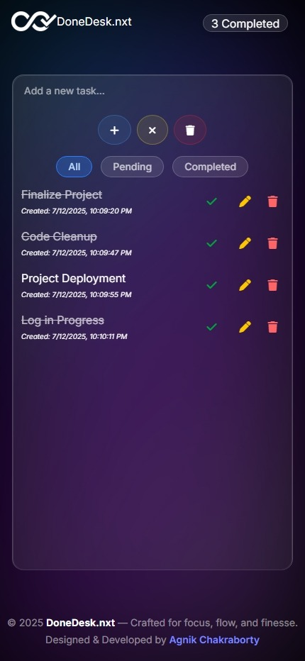

# ✅ DoneDesk.nxt · v2.0

A Glassmorphic, local-first, minimalistic to-do list built with React — designed for clarity, speed, and elegance.

!🔗 **Live Site:**

---

## ✨ Features

- 📌 **Add, Edit, Delete Tasks**
- ✅ **Mark as Completed**
- 💾 **LocalStorage Persistence**
- 📱 **Responsive UI for Mobile Devices**
- 🌒 **Dark/Light Themes (Auto)**
- 🎛️ **Task Filters (All / Completed / Pending)**
- 🎯 **Completed Tasks Tracker**
- 🌀 **Animated Aurora Background with Framer Motion**

---

## ⚙️ Tech Stack

- **React**
- **Tailwind CSS**
- **Framer Motion**
- **HTML5 + LocalStorage API**
- **Responsive Design (Mobile & Desktop)**

---

## 🖥️ Screenshots

### ✅ Tasks Page


### ➕ Empty State


### 📱 Mobile View



---

## 🚀 Getting Started

1. **Clone the repo**
   ```bash
   git clone https://github.com/lucid-val/donedesk.nxt.git
   cd donedesk.nxt
   ```

2. **Install dependencies**
   ```bash
   npm install
   ```

3. **Start the dev server**
   ```bash
   npm run dev
   ```

4. Visit: `http://localhost:5173`

---

## 📁 Folder Structure

```
.
├── public/             # Static assets (icons, screenshots)
├── src/
│   ├── components/     # All UI components
│   ├── App.jsx         # Root app
│   ├── main.jsx        # Entry point
├── tailwind.config.js
├── package.json
└── README.md
```

---

## 📄 License

This project is for learning and personal use. For professional use or contributions, feel free to fork or reach out via GitHub.

---

## ✍️ Designed & Developed By

**Agnik Chakraborty**    
🐙 [GitHub](https://github.com/Lucid-val)  
💼 [LinkedIn](https://www.linkedin.com/in/agnik-chakraborty-515b552b4/)

---

> “Productivity doesn’t have to be boring. DoneDesk.nxt brings clarity with class.”
